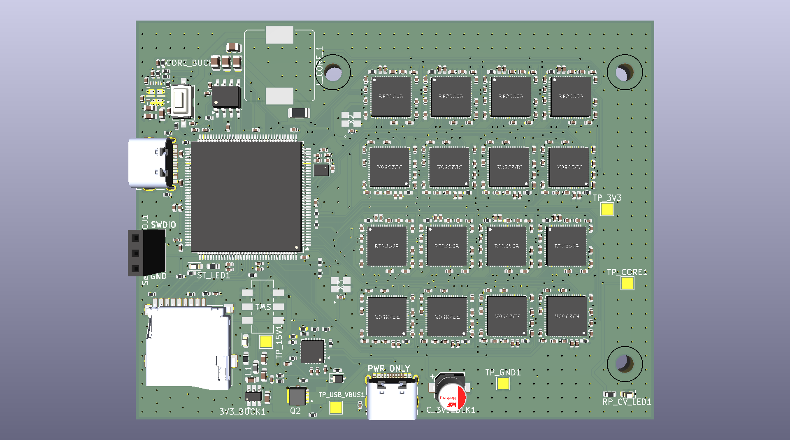

# RP2350 Compute Cluster

A custom compute cluster made up of 16, 90 cent RP2350s! The goal of this project is to be able to run POSIX programs on hardware that was not designed for it. The RP2350 was chosen for it's dual-core nature with FPUs at the low price point of 90 cents on Digikey. On top of that it also has an MPU so memory faults can offload the burden of handling virtual memory to the hardware.

## Why?
I created this project for two reasons: first, hardware decoders are no longer sold separately, and second, I wanted to apply my skills to a fun and complex project.

## System Architecture

The project is divided into four distinct repositories, the compute cluster node firmware, the cluster orchestrator firmware, the linux usb code, and the actual compute pcb.

* [`pico`](pico): The cluster node. Contains the VMMU(Virtual Memory Management Unit) and interface functions that provides the platform to run client programs.
* [`stm_cluster_orchestrator`](stm_cluster_orchestrator): A parallel codebase to pico, serving as an auxillery interface that provides additional caching and USB 2.0 High Speed communication.
* [`linux`](linux): Linux user-space application responsible for controlling the cluster. It serves commands over USB to the cluster, handles file management, and serves as a swap provider of last resort.
* [`pcb-design`](rp2350-Graphics-Array): The EDA files of the compute cluster.

## Work in Progress

- [x] PCB schematic and layout
- [X] DAV1D Compiling against Pico!🎉
- [X] Client Program Compilation
- [X] Client Program Binary Extraction
- [X] Client Program Loading
- [X] POSIX Pthread create support
- [X] MPU-Based Paging
- [X] Memory Handling
- [ ] File Management | In Progress
- [ ] Log Commands from Cluster | In Progress
- [ ] Neigbor-Node Page Fetching | In Progress
- [ ] Physical PCB Testing | In Progress
- [ ] SD Card Caching
- [ ] Flash Program Caching